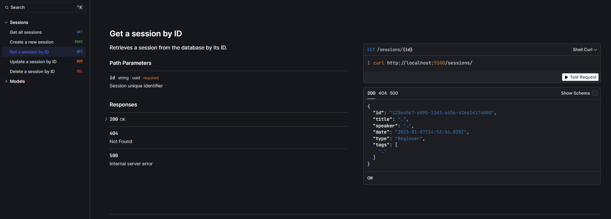
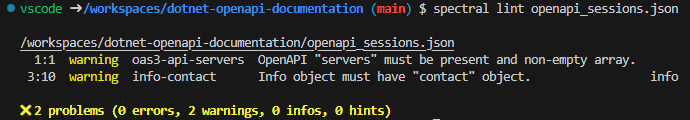

# 🚀 .NET 9 CRUD API with OpenAPI documentation

This project is a **minimal .NET API** with a basic CRUD API around sessions with all OpenAPI configuration.

## 📁 Project Structure

The main project structure is as follows:

```plaintext
dotnet-multiapi-containerized-devcontainer/
├── .devcontainer/            # Dev Container configuration
│   ├── devcontainer.json
│   └── Dockerfile
├──.spectral.yml              # Spectral linter file
├── dotnet-openapi-documentation.csproj
├── dotnet-openapi-documentation.sln
├── LocalDB.cs                # Local database for seeding Sessions
├── openapi_sessions.json     # OpenAPI file auto-generated at build time
├── OpenApiTransformer.cs     # Custom transformers
├── Program.cs
├── README.md                 # Documentation (you are here)
├── Session.cs                # Session record
└── SessionEndpoints.cs       # Session endpoints group
```

## ⚙️ Prerequisites

Before starting, ensure you have the following tools installed:

- **[Docker Desktop](https://www.docker.com/products/docker-desktop/)** (to run containers locally)
- **[Visual Studio Code](https://code.visualstudio.com/)** with the **Dev Containers** extension (`ms-vscode-remote.remote-containers`)
- **[.NET SDK 9.0](https://dotnet.microsoft.com/download)** only if you or a member of your team want to work outside the container
- **[Spectral CLI](https://github.com/stoplightio/spectral#-installation)** only if you or a member of your team want to work outside the container

## 🚧 Getting Started

### 1. Launch Development Environment with Dev Containers

Open the project in VS Code.

Ensure the Dev Containers extension is installed.

Open the command palette (Ctrl+Shift+P or Cmd+Shift+P) and select:

```bash
Dev Containers: Reopen in Container
```

This will rebuild and launch the development environment inside a Docker container. There are devcontainer image for .NET 9, installation of Node.js and spectral npm package

### 2. Build and Run the API

To run the API from your devcontainer, launch dotnet run command :

```bash
dotnet run
```

The API will be accessible at the following addresses <http://localhost:5100>

## 🛠️ What's inside ?

### Session record

This is the object used for CRUD operation

```csharp
public record Session(
  Guid Id,
  [property: Description("The title of the session")]
  [property: MaxLength(120)]
  string Title,
  [property: Description("The speaker of the session")]
  string Speaker,
  [property: Description("The date of the session")]
  DateTime Date,
  [property: Description("The type of the session")]
  SessionType Type,
  [property: Description("The tags of the session")]
  List<string> Tags
);


[JsonConverter(typeof(JsonStringEnumConverter<SessionType>))]
public enum SessionType
{
    [Description("A session for beginners")]
    Beginner,
    [Description("A session for intermediate users")]
    Intermediate,
    [Description("A session for advanced users")]
    Advanced
}
```

***Description*** attributes allow to add some details for properties inside OpenApi Session schema

***JsonConverter*** attribute around enum allows to transform integer values to string values. It's propagated to OpenApi Session schema

### Session CRUD operation endpoints

To define endpoints, I use a group around 'sessions' subpath :
```app.MapGroup("/sessions").MapSessions().WithTags("Sessions");```

***WithTag*** extension method add a Tag inside OpenApi document for all session endpoints of the group.

#### Endpoint example

```csharp
group.MapGet("/{id}", ([Description("Session unique identifier")] Guid id) => GetSession(id))
            .WithSummary("Get a session by ID")
            .WithDescription("Retrieves a session from the database by its ID.")
            .WithName(nameof(GetSession))
            .Produces<Session>(StatusCodes.Status200OK)
            .Produces(StatusCodes.Status404NotFound);
```

***Description*** attribute arroud id parameter allows to add some details for the parameter inside OpenApi Session schema

***WithSummary*** and ***WithSummary*** extension methods add some details on the operation in the OpenApi document.

***WithName*** extension method add a unique name/id on the operation in the OpenApi document.

***Produces*** extension method allow to specify all responses for the operation in the OpenApi document.

### OpenApi document customization

You can customize your OpenApi document with ***Transformers*** on three categories : document, operation and schema. Inside OpenApiTransformers.cs file, you will find one example on each categories :

* ***InformationsDocumentTransformer*** method to customize document informations
* ***InternalErrorOperationTransformer*** method to add 500 internal errors response on all operations
* ***EnumSchemaTransformer*** (with ***OverrideEnumSchemaReference***) method to allow enum properties to be string instead of schema

### Scalar UI 

[Scalar](https://scalar.com/) is an open-source interactive document UI for OpenAPI. A nuget package **Scalar.AspNetCore** is available to add UI endpoint through ```app.MapScalarApiReference();``` code line.



### Spectral linter

You can know at build-time if your OpenApi document is correct. This tool is installed in the Dockerfile of the devcontainer.

To generate your OpenApi at build-time, you have to install the nuget package **Microsoft.Extensions.ApiDescription.Server** and then add some properties inside your csproj file :

```xml
  <PropertyGroup>
    <OpenApiDocumentsDirectory>$(MSBuildProjectDirectory)</OpenApiDocumentsDirectory>
    <OpenApiGenerateDocuments>true</OpenApiGenerateDocuments>
    <OpenApiGenerateDocumentsOptions>--file-name openapi</OpenApiGenerateDocumentsOptions>
  </PropertyGroup>
```

You can customize file name prefix with ***OpenApiGenerateDocumentsOptions*** tag. Here my file will be openapi_sessions.json because of how I add OpenAPI service in ***Program.cs*** :


```csharp
builder.Services.AddOpenApi("sessions", options =>
{
    options.AddDocumentTransformer(OpenApiTransformers.InformationsDocumentTransformer());

    options.AddOperationTransformer(OpenApiTransformers.InternalErrorOperationTransformer());

    options.CreateSchemaReferenceId = OpenApiTransformers.OverrideEnumSchemaReference();

    options.AddSchemaTransformer(OpenApiTransformers.EnumSchemaTransformer());
});
```

Now you can launch Spectral to have warning/errors with command :

```spectral lint openapi_sessions.json```


## 🔗 Useful Resources

- [OpenAPI documentation for .NET 9](https://learn.microsoft.com/en-us/aspnet/core/fundamentals/openapi/overview?view=aspnetcore-9.0)
- [Dev Containers based on Dockefile Documentation](https://code.visualstudio.com/docs/devcontainers/create-dev-container#_dockerfile)

## Contributing

Pull requests are welcome. For major changes, please open an issue first
to discuss what you would like to change.

## License

[MIT](https://choosealicense.com/licenses/mit/)